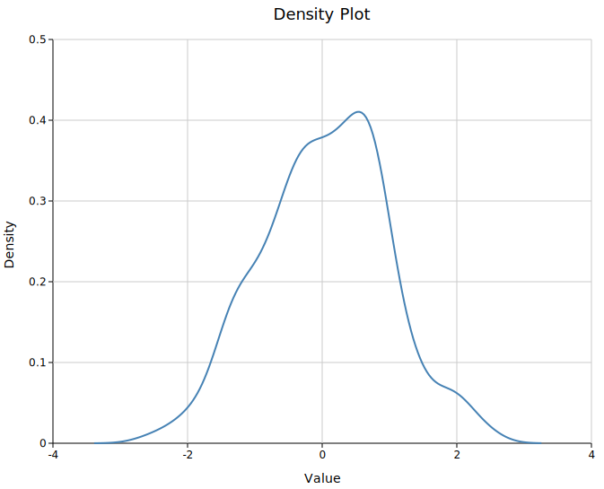
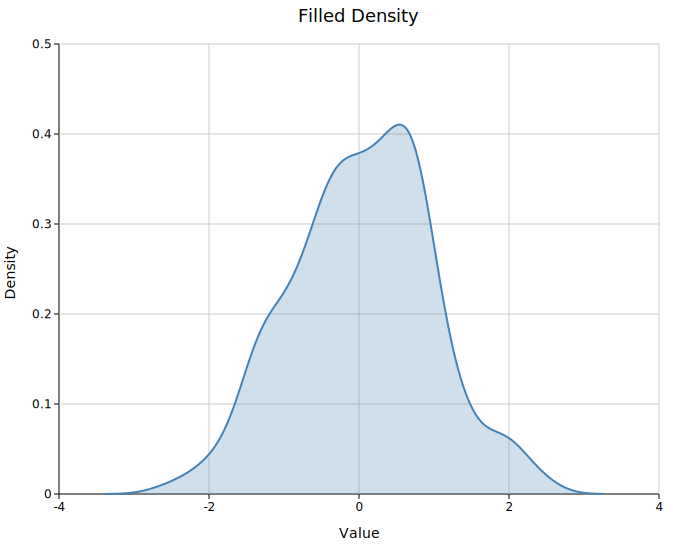
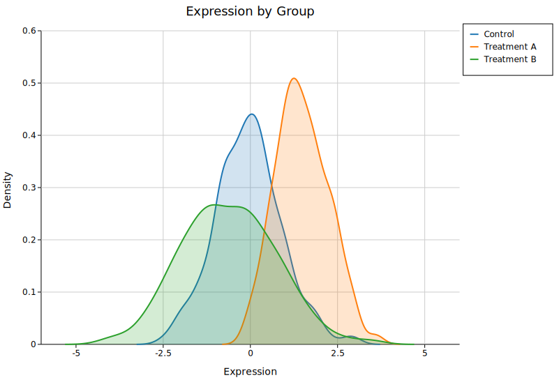
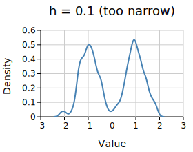
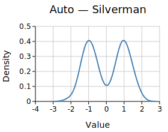
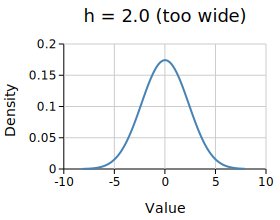

# Density Plot

A density plot estimates the probability density of a numeric dataset via Gaussian kernel density estimation (KDE) and renders it as a smooth continuous curve. It is the continuous alternative to a histogram — it shows the same shape without the arbitrary bin boundaries, and curves from multiple groups can be overlaid naturally.

**Import path:** `kuva::plot::DensityPlot`

---

## Basic usage

Pass raw data values with `.with_data(iter)`. The bandwidth is chosen automatically using Silverman's rule-of-thumb.

```rust,no_run
use kuva::plot::DensityPlot;
use kuva::backend::svg::SvgBackend;
use kuva::render::render::render_multiple;
use kuva::render::layout::Layout;
use kuva::render::plots::Plot;

let data = vec![2.1, 3.4, 3.7, 2.8, 4.2, 3.9, 3.1, 2.5, 4.0, 3.3,
                2.9, 3.6, 2.7, 3.8, 3.2, 4.1, 2.6, 3.5, 3.0, 4.3];

let density = DensityPlot::new()
    .with_data(data)
    .with_color("steelblue");

let plots = vec![Plot::Density(density)];
let layout = Layout::auto_from_plots(&plots)
    .with_title("Expression Distribution")
    .with_x_label("Expression")
    .with_y_label("Density");

let scene = render_multiple(plots, layout);
let svg = SvgBackend.render_scene(&scene);
std::fs::write("density.svg", svg).unwrap();
```



The y-axis is a proper probability density: each curve integrates to approximately 1 over the visible range.

---

## Filled area

`.with_filled(true)` shades the area under the curve. The fill uses the same color as the stroke at a low opacity (default `0.2`).

```rust,no_run
# use kuva::plot::DensityPlot;
let density = DensityPlot::new()
    .with_data(data)
    .with_color("steelblue")
    .with_filled(true)
    .with_opacity(0.25);
```



---

## Multiple groups

Use one `DensityPlot` per group and collect them into a single `Vec<Plot>`. Set `.with_palette()` on the layout to auto-assign colors, or assign colors and legend labels manually.

```rust,no_run
use kuva::plot::DensityPlot;
use kuva::backend::svg::SvgBackend;
use kuva::render::render::render_multiple;
use kuva::render::layout::Layout;
use kuva::render::plots::Plot;
use kuva::render::palette::Palette;

let pal = Palette::category10();

let plots = vec![
    Plot::Density(
        DensityPlot::new()
            .with_data(group_a)
            .with_color(pal[0])
            .with_filled(true)
            .with_legend("Control"),
    ),
    Plot::Density(
        DensityPlot::new()
            .with_data(group_b)
            .with_color(pal[1])
            .with_filled(true)
            .with_legend("Treatment A"),
    ),
    Plot::Density(
        DensityPlot::new()
            .with_data(group_c)
            .with_color(pal[2])
            .with_filled(true)
            .with_legend("Treatment B"),
    ),
];

let layout = Layout::auto_from_plots(&plots)
    .with_title("Expression by Group")
    .with_x_label("Expression")
    .with_y_label("Density");

let svg = SvgBackend.render_scene(&render_multiple(plots, layout));
std::fs::write("density_groups.svg", svg).unwrap();
```



Overlapping filled curves distinguish naturally by color. Increase `.with_opacity()` toward `0.4` if groups are well separated, or keep it low (`0.15`–`0.2`) when they overlap heavily.

---

## KDE bandwidth

Bandwidth controls smoothing. Silverman's rule works well for roughly normal unimodal data. Set it manually with `.with_bandwidth(h)` when the automatic choice is too smooth (blends modes) or too rough (noisy).

```rust,no_run
# use kuva::plot::DensityPlot;
// Over-smoothed — modes blend together
let d = DensityPlot::new().with_data(data.clone()).with_bandwidth(2.0);

// Automatic — Silverman's rule (default, no call needed)
let d = DensityPlot::new().with_data(data.clone());

// Under-smoothed — noisy, jagged
let d = DensityPlot::new().with_data(data.clone()).with_bandwidth(0.1);
```

<table>
<tr>
<td></td>
<td></td>
<td></td>
</tr>
<tr>
<td align="center"><code>h = 0.1</code> (too narrow)</td>
<td align="center">Auto — Silverman</td>
<td align="center"><code>h = 2.0</code> (too wide)</td>
</tr>
</table>

`.with_kde_samples(n)` controls how many points the curve is evaluated at (default `200`). The default is smooth enough for most screen resolutions.

---

## Dashed lines

`.with_line_dash("4 2")` applies an SVG stroke-dasharray. Useful when distinguishing groups in print or greyscale output.

```rust,no_run
# use kuva::plot::DensityPlot;
let d = DensityPlot::new()
    .with_data(data)
    .with_color("steelblue")
    .with_stroke_width(2.0)
    .with_line_dash("6 3");
```

---

## Pre-computed curves

`DensityPlot::from_curve(x, y)` accepts a pre-smoothed curve directly — useful when the density was already computed in Python or R:

```rust,no_run
use kuva::plot::DensityPlot;

// x and y computed externally (e.g. scipy.stats.gaussian_kde)
let x = vec![0.0, 0.5, 1.0, 1.5, 2.0, 2.5, 3.0];
let y = vec![0.05, 0.15, 0.40, 0.55, 0.40, 0.15, 0.05];

let density = DensityPlot::from_curve(x, y)
    .with_color("coral")
    .with_filled(true);
```

---

## API reference

| Method | Description |
|--------|-------------|
| `DensityPlot::new()` | Create a density plot with defaults |
| `DensityPlot::from_curve(x, y)` | Use a pre-computed curve; bypasses KDE |
| `.with_data(iter)` | Set input values; accepts any `Into<f64>` numeric type |
| `.with_color(s)` | Curve color (CSS color string) |
| `.with_filled(bool)` | Fill the area under the curve (default `false`) |
| `.with_opacity(f)` | Fill opacity when filled (default `0.2`) |
| `.with_bandwidth(h)` | KDE bandwidth; omit for Silverman's rule |
| `.with_kde_samples(n)` | KDE evaluation points (default `200`) |
| `.with_stroke_width(px)` | Outline stroke width (default `1.5`) |
| `.with_line_dash(s)` | SVG stroke-dasharray, e.g. `"4 2"` for dashed |
| `.with_legend(s)` | Attach a legend label |
