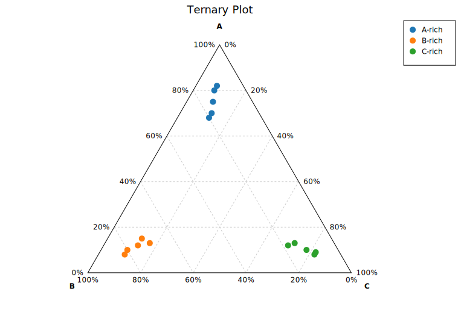
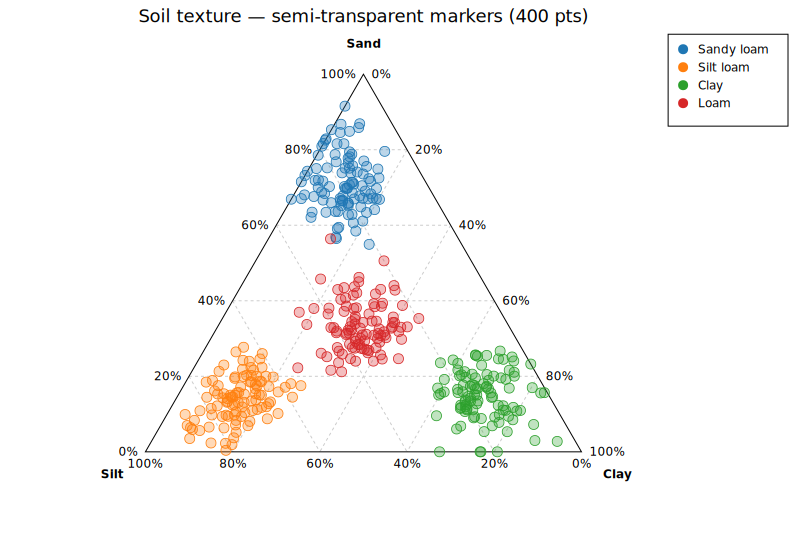

# Ternary Plot

A ternary plot (also called a simplex plot or de Finetti diagram) visualizes compositional data where each point has three components that sum to a constant (typically 1 or 100%).

The plot is rendered as an equilateral triangle. Each vertex represents 100% of one component; the opposite edge represents 0%. An interior point's distance from each edge corresponds to its component fraction.



## Rust API

```rust
use kuva::plot::ternary::TernaryPlot;
use kuva::render::layout::Layout;
use kuva::render::plots::Plot;
use kuva::render::render::render_multiple;
use kuva::backend::svg::SvgBackend;

let plot = TernaryPlot::new()
    .with_corner_labels("Clay", "Silt", "Sand")
    .with_point_group(0.70, 0.20, 0.10, "Clay loam")
    .with_point_group(0.10, 0.70, 0.20, "Silt loam")
    .with_point_group(0.20, 0.10, 0.70, "Sandy loam")
    .with_grid_lines(5)
    .with_legend(true);

let plots = vec![Plot::Ternary(plot)];
let layout = Layout::auto_from_plots(&plots).with_title("Soil Texture");
let svg = SvgBackend.render_scene(&render_multiple(plots, layout));
```

### Adding points

```rust
// Single ungrouped point
let plot = TernaryPlot::new().with_point(0.5, 0.3, 0.2);

// Point with group label (for color coding and legend)
let plot = TernaryPlot::new().with_point_group(0.7, 0.2, 0.1, "A-rich");

// Multiple points from an iterator
let data = vec![(0.5, 0.3, 0.2), (0.3, 0.5, 0.2), (0.2, 0.3, 0.5)];
let plot = TernaryPlot::new().with_points(data);
```

### Normalization

If your data components don't sum to 1 (e.g. percentages that sum to 100, or raw counts), use `with_normalize`:

```rust
let plot = TernaryPlot::new()
    .with_point(60.0, 25.0, 15.0)  // sums to 100
    .with_normalize(true);          // auto-divides by sum
```

### Marker opacity and stroke

For ternary plots with many overlapping points, semi-transparent or hollow markers reveal local density without merging into an opaque mass.

Four soil-texture classes with 100 points each. The class boundaries overlap, so solid markers hide whether a boundary sample belongs to one class or straddles two. At `opacity = 0.3` the boundary region between Sandy loam and Loam becomes visibly darker, and individual points remain countable through the thin `0.8 px` stroke.

```rust,no_run
use kuva::plot::ternary::TernaryPlot;
use kuva::backend::svg::SvgBackend;
use kuva::render::render::render_multiple;
use kuva::render::layout::Layout;
use kuva::render::plots::Plot;

// (populate each group with 100 (a, b, c) compositional samples)
# let mut plot = TernaryPlot::new();
let plot = TernaryPlot::new()
    .with_corner_labels("Sand", "Silt", "Clay")
    .with_normalize(true)
    .with_legend(true)
    .with_marker_size(5.0)
    .with_marker_opacity(0.3)
    .with_marker_stroke_width(0.8);
// .with_point_group(a, b, c, "Sandy loam")  ← repeated for each sample

let plots = vec![Plot::Ternary(plot)];
let layout = Layout::auto_from_plots(&plots)
    .with_title("Soil texture — semi-transparent markers (400 pts)");

let svg = SvgBackend.render_scene(&render_multiple(plots, layout));
```



The stroke color matches the group color (or the category10 palette color for ungrouped points).

### Builder reference

| Method | Default | Description |
|---|---|---|
| `.with_point(a, b, c)` | — | Add ungrouped point |
| `.with_point_group(a, b, c, group)` | — | Add point with group label |
| `.with_points(iter)` | — | Add multiple ungrouped points |
| `.with_corner_labels(top, left, right)` | `"A","B","C"` | Vertex labels |
| `.with_normalize(bool)` | `false` | Auto-normalize each row |
| `.with_marker_size(f64)` | `5.0` | Point radius in pixels |
| `.with_grid_lines(n)` | `5` | Grid divisions per axis |
| `.with_grid(bool)` | `true` | Show dashed grid lines |
| `.with_percentages(bool)` | `true` | Show % tick labels on each edge |
| `.with_legend(bool)` | `false` | Show group legend |
| `.with_marker_opacity(f)` | solid | Fill alpha: `0.0` = hollow, `1.0` = solid |
| `.with_marker_stroke_width(w)` | none | Outline stroke at the fill color |

## CLI

```bash
# Basic ternary with named columns
kuva ternary data.tsv --a a --b b --c c --title "Ternary Plot"

# With group colors and custom vertex labels
kuva ternary data.tsv --a a --b b --c c --color-by group \
    --a-label "Clay" --b-label "Silt" --c-label "Sand" \
    --title "Soil Texture Triangle"

# Normalize raw counts
kuva ternary data.tsv --a counts_a --b counts_b --c counts_c \
    --normalize --title "Normalized Composition"
```

### CLI flags

| Flag | Default | Description |
|---|---|---|
| `--a <COL>` | `0` | Top-vertex (A) component column |
| `--b <COL>` | `1` | Bottom-left (B) component column |
| `--c <COL>` | `2` | Bottom-right (C) component column |
| `--color-by <COL>` | — | One color per unique group value |
| `--a-label <S>` | `A` | Top vertex label |
| `--b-label <S>` | `B` | Bottom-left vertex label |
| `--c-label <S>` | `C` | Bottom-right vertex label |
| `--normalize` | off | Auto-normalize each row (a+b+c=1) |
| `--grid-lines <N>` | `5` | Grid lines per axis |
| `--legend` | off | Show legend |
